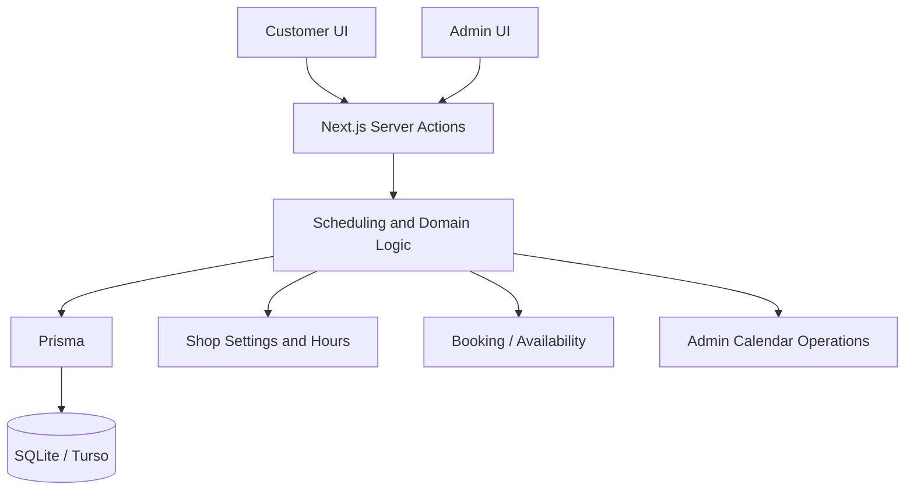

# Barber Booking System

A full-stack, Hebrew-first appointment booking system for a single-provider barbershop.

This repository is the public portfolio release of the project. It contains the customer booking experience, the admin workspace, the scheduling domain logic, database migrations, and the automated test suite.

## Highlights

- Customer booking flow with service, date and time selection
- Admin day view for appointments, walk-ins, cancellations, rescheduling and time blocking
- Weekly opening hours and date-specific overrides
- Service and price management
- Shop details, branding and portfolio media
- Stale-availability recovery when business hours change after a customer has loaded the page
- Shared scheduling rules across customer and admin flows
- Calendar-write protection and database-backed conflict checks
- Responsive Hebrew RTL interface
- Public demo mode with resettable demo data

## Architecture



The application uses the Next.js App Router. UI and transport concerns stay close to the routes, while scheduling, availability, booking, admin calendar operations and shop configuration live in reusable domain helpers under `src/lib`.

## Booking integrity

The server remains the source of truth for calendar state. Before calendar mutations are written, current availability is validated again.

The system protects against cases such as:

- two appointments taking the same slot
- appointments overlapping blocked time
- stale customer availability after an admin schedule change
- rescheduling into an occupied period
- invalid weekly-hour and slot-interval combinations
- admin walk-ins without a phone number unless explicitly confirmed

## Tech stack

| Area | Technology |
| --- | --- |
| Framework | Next.js 16 |
| UI | React 19 |
| Language | TypeScript |
| Styling | Tailwind CSS 4 |
| ORM | Prisma 6 |
| Database | SQLite locally, Turso/libSQL for the public demo |
| Tests | Vitest 3 |
| Auth/session | jose |
| Media | sharp + storage abstraction |
| Drag and drop | dnd-kit |

## Quality

At the demo freeze, the project passed:

- **252 automated tests**
- TypeScript type-checking
- ESLint
- production build
- `git diff --check`

Run the quality checks locally:

```bash
npm test
npx tsc --noEmit
npm run lint
npm run build
```

## Project structure

```text
prisma/
  migrations/
  schema.prisma
  seed.ts

src/
  app/
    _components/
    admin/
    actions.ts
  lib/
    availability.ts
    booking.ts
    adminDay.ts
    shopHours.ts
    shopSettings.ts
    media/
  test/
```

## Local setup

Install dependencies:

```bash
npm install
```

Create the environment file:

```bash
cp .env.example .env
```

On Windows PowerShell:

```powershell
Copy-Item .env.example .env
```

Generate Prisma, apply migrations, and seed local data:

```bash
npx prisma generate
npx prisma migrate deploy
npx prisma db seed
```

Start development:

```bash
npm run dev
```

Customer interface:

```text
http://localhost:3000
```

Admin interface:

```text
http://localhost:3000/admin/login
```

## Environment variables

Only placeholder values are committed in `.env.example`.

```text
DATABASE_URL
ADMIN_PASSWORD
SESSION_SECRET
IMPLEMENTER_EMAIL
IMPLEMENTER_WHATSAPP
USE_TURSO
TURSO_DATABASE_URL
TURSO_AUTH_TOKEN
DEMO_MODE
```

Real credentials, local database files and uploaded media are intentionally excluded from version control.

## Demo and production scope

The hosted version is a portfolio demo, not a production booking service. Demo reset behavior is separated from the core scheduling flows.

A production rollout would still require production secret management, durable media storage, abuse/rate-limit protection, monitoring, and re-validation of the concurrency strategy against the selected production database.

## Development approach

The project was developed with AI-assisted coding agents as part of the engineering workflow. Product scope, requirements, architecture decisions, review criteria, testing, QA and integration were directed and validated by the project owner.

## Repository history

This is a curated public portfolio repository. The complete development history remains in a private repository; this repository starts from a clean public release rather than reproducing or fabricating historical commits.

## Status

**Public demo release frozen from the validated project state on 2026-09-23.**
