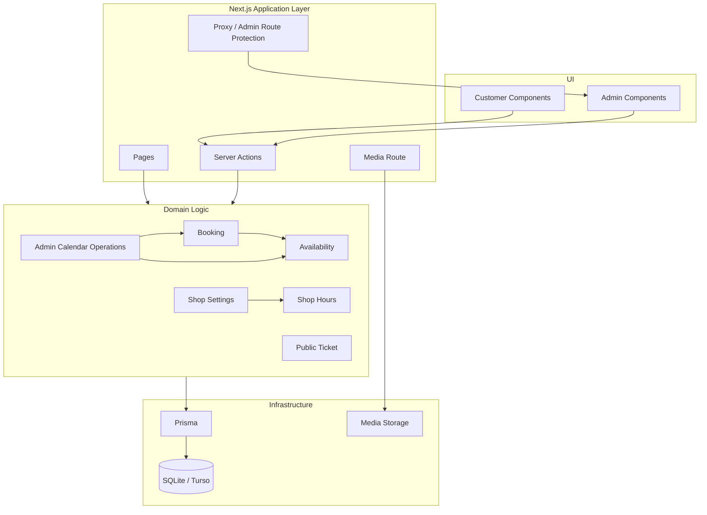
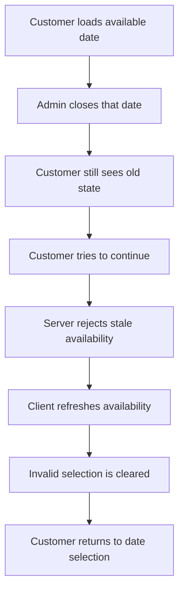

# Barber Booking System

A production-minded, Hebrew-first booking system for a single-provider barbershop — with a complete customer booking flow, an interactive admin workspace, shared scheduling rules, and a tested full-stack architecture.

**Live demo:** [Customer booking](https://barber-booking-xi-ruby.vercel.app/) · [Admin workspace](https://barber-booking-xi-ruby.vercel.app/admin)

**Stack:** Next.js 16 · React 19 · TypeScript · Prisma 6 · Turso/libSQL · Vitest 3 · Tailwind CSS 4

**Demo freeze validation:** 252 automated tests · TypeScript · ESLint · production build · `git diff --check`

---

## Try the Demo

The public deployment is intentionally interactive. You can explore both sides of the system without affecting real business data.

### Customer side

Open the [Customer Booking Demo](https://barber-booking-xi-ruby.vercel.app/) and try:

- browsing active services, prices, and durations
- selecting an available date
- selecting a valid appointment time
- completing a booking
- viewing the saved upcoming appointment
- adding the appointment to a calendar
- requesting cancellation through WhatsApp
- continuing safely when availability changes after the page was already loaded

### Admin side

Open the [Admin Workspace](https://barber-booking-xi-ruby.vercel.app/admin) and try:

- viewing today's appointments and navigating the calendar
- creating a manual appointment
- rescheduling or cancelling an appointment
- blocking time in the schedule
- searching appointments
- editing weekly opening hours
- setting date-specific opening hours
- closing one day or a continuous date range
- changing the booking interval
- managing services and prices
- editing shop details
- managing branding and portfolio media

The hosted admin opens directly in demo mode. Demo data is reset automatically so visitors can safely experiment with the system.

---

## Why This Project Matters

This is not only a booking UI.

The application includes real scheduling behavior and state transitions behind the interface:

- customer and admin flows share the same scheduling rules
- availability is calculated from opening hours, date-specific overrides, existing appointments, and blocked time
- calendar mutations are validated against current server state before they are written
- stale customer availability is detected and recovered instead of being trusted
- booking, rescheduling, cancellation, and blocking protect against conflicting calendar state
- admin configuration is validated before it can create inconsistent scheduling behavior
- important flows are covered by automated regression tests

The project was built around one practical question:

> What happens when the state changes after the UI has already been loaded?

That question shaped the booking flow, the admin calendar, the availability layer, and the test strategy.

---

## Product Overview

The system is designed for a single service provider such as a barber, therapist, consultant, or similar appointment-based business.

Customers can book without creating an account, while the business owner receives a dedicated admin interface for managing the operational schedule.

The current scope intentionally focuses on one provider and one shop. Multi-provider scheduling, payments, customer accounts, and external calendar synchronization are outside the current scope.

---

## Core Features

### Customer experience

- browse active services
- view service duration and price
- browse available dates
- view available time slots
- book without registration
- validate customer details
- prevent stale availability from completing an invalid booking
- prevent duplicate submissions
- keep the latest appointment ticket locally
- refresh the saved ticket from current server state
- reflect admin rescheduling back into the customer ticket
- remove cancelled or missing appointments from the saved ticket
- request cancellation through WhatsApp
- add an appointment to a calendar
- view shop hours, notices, location, branding, and portfolio media

### Admin experience

- daily schedule overview
- today's appointments
- manual appointment creation
- appointment cancellation
- appointment rescheduling
- time blocking
- partial block changes
- appointment search
- service and price management
- service ordering
- weekly opening hours
- date-specific opening-hour overrides
- single-day and date-range closures
- configurable booking intervals
- shop details
- branding and portfolio media
- keyboard-accessible dialogs and focus handling

---

## Architecture

The project uses the Next.js App Router and separates UI, server-entry points, domain logic, persistence, and media handling.



### Architectural characteristics

- **Thin transport layer** — server actions parse input, obtain the relevant context, delegate to business logic, and trigger revalidation.
- **Shared scheduling rules** — booking, rescheduling, blocking, and availability rely on the same domain-level rules.
- **Server-authoritative availability** — the UI never gets the final word on whether a slot can still be booked.
- **Authenticated admin operations** — privileged operations are checked server-side rather than relying only on route protection.
- **Storage abstraction** — media access is isolated behind a storage interface.
- **Timezone-aware scheduling** — business rules operate in the configured timezone while real instants are stored in the database.

---

## Booking Integrity

Calendar correctness is one of the main engineering concerns in the project.

The system protects against:

- two appointments taking the same slot
- appointments overlapping blocked periods
- blocks being created over existing appointments
- stale partial-block updates recreating an overlap
- booking after a requested start time has already passed
- rescheduling against stale calendar state
- cancellation against stale appointment state
- malformed weekly-hours payloads
- opening times that do not align with the configured booking interval
- interval changes that would invalidate saved opening-hour configuration
- stale customer state after an admin schedule change

### Stale availability recovery

A representative flow:



The result is a recoverable product state rather than a generic failure screen.

---

## Testing and Quality

The test suite combines unit-style domain tests and database-backed integration tests.

Coverage includes:

- booking creation
- concurrent booking attempts
- booking vs. time-block races
- availability generation
- stale-availability recovery
- rescheduling
- cancellation
- manual admin appointments
- weekly opening hours
- date-specific overrides
- date-range closures
- booking interval validation
- customer field validation
- public appointment ticket synchronization
- admin authorization helpers
- service management
- media storage and media rules
- WhatsApp URL generation
- calendar helpers
- regression tests added during hardening passes

At demo freeze, the project passed:

- **252 automated tests**
- TypeScript type-checking
- ESLint
- production build
- `git diff --check`

Run the main quality checks locally:

```bash
npm test
npx tsc --noEmit
npm run lint
npm run build
```

---

## Tech Stack

| Area | Technology |
| --- | --- |
| Framework | Next.js 16 |
| UI | React 19 |
| Language | TypeScript |
| Styling | Tailwind CSS 4 |
| ORM | Prisma 6 |
| Database | SQLite locally, Turso/libSQL for the public demo |
| Tests | Vitest 3 |
| Authentication/session | jose |
| Image processing | sharp |
| Drag and drop | dnd-kit |

---

## Repository Structure

```text
.
├── prisma/
│   ├── migrations/
│   ├── schema.prisma
│   └── seed.ts
│
├── public/
│
├── src/
│   ├── app/
│   │   ├── _components/
│   │   ├── admin/
│   │   ├── demo/
│   │   ├── media/
│   │   ├── actions.ts
│   │   └── page.tsx
│   │
│   ├── lib/
│   │   ├── media/
│   │   ├── adminDay.ts
│   │   ├── availability.ts
│   │   ├── booking.ts
│   │   ├── publicTicket.ts
│   │   ├── shopHours.ts
│   │   └── shopSettings.ts
│   │
│   ├── test/
│   └── proxy.ts
│
├── .env.example
├── package.json
├── tsconfig.json
└── vitest.config.ts
```

---

## Local Setup

### 1. Install dependencies

```bash
npm install
```

### 2. Create the environment file

```bash
cp .env.example .env
```

On Windows PowerShell:

```powershell
Copy-Item .env.example .env
```

### 3. Configure environment variables

See `.env.example` and replace placeholder values with local development values.

### 4. Generate Prisma and apply migrations

```bash
npx prisma generate
npx prisma migrate deploy
```

### 5. Seed local data

```bash
npx prisma db seed
```

### 6. Start development

```bash
npm run dev
```

Customer interface:

```text
http://localhost:3000
```

Admin interface:

```text
http://localhost:3000/admin/login
```

---

## Environment Variables

Only placeholder values are committed in `.env.example`.

Main variables:

```text
DATABASE_URL
ADMIN_PASSWORD
SESSION_SECRET
IMPLEMENTER_EMAIL
IMPLEMENTER_WHATSAPP
USE_TURSO
TURSO_DATABASE_URL
TURSO_AUTH_TOKEN
DEMO_MODE
```

Real credentials, local database files, uploaded media, build output, and local development artifacts are excluded from version control.

---

## Demo vs. Production

The hosted version is a portfolio demo, not a production booking service.

Demo-specific reset behavior is intentionally kept separate from the core scheduling flows.

A production rollout would still require decisions around:

- production database architecture
- durable media storage
- secret management
- abuse and rate-limit protection
- monitoring and operational safeguards
- production authentication policy
- concurrency validation against the selected production database

---

## Development Approach

The project was developed with AI-assisted coding agents as part of the engineering workflow.

Product scope, requirements, architecture decisions, review criteria, testing, QA, integration, and release decisions were directed and validated by the project owner.

The public repository is intentionally curated for portfolio review. The complete development history remains in a private repository rather than being artificially reconstructed here.

---

## Project Status

**Public demo release frozen and deployed on 2026-09-23.**

- Public repository: `SabagOded/barber-booking-system`
- Customer demo: https://barber-booking-xi-ruby.vercel.app/
- Admin demo: https://barber-booking-xi-ruby.vercel.app/admin
